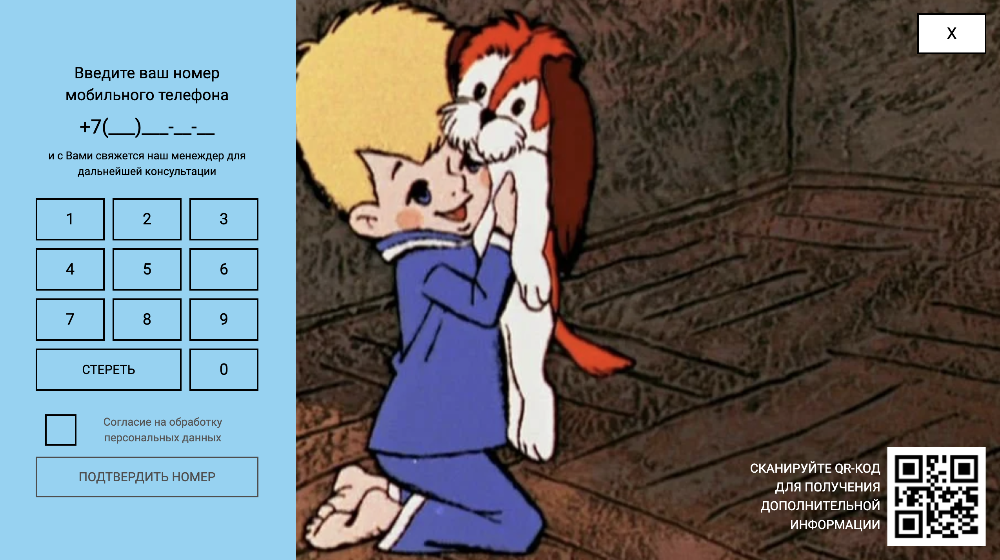

## Request

***

***

### Description

<i>Small SPA about with :
- includes three screens:
    * [StartScreen](#start);
    * [MainScreen](#main);
    * [SuccessScreen](#success);

***

#### `StartScreen`
<i>This screen includes:
* Volvo Trucks - The Epic Split feat. Van Damme (Live Test);
* banner with QR and start button;

***

#### `MainScreen`
<i>It consists:
* main panel with numbers: fill the gap and try to make request, 
if your number is valid you will transfer to next screen;
* QR - code;
* button - go to startscreen;

***

#### `SuccessScreen`
<i>Screen with final words and button - to make another request!

### Tech Stack

* [x] HTML;
* [x] TypeScript;
* [x] CSS/SCSS;
* [x] Tailwind CSS;
* [x] React JS;
* [x] Zustand;
* [x] RxJS;

***

### Contacts

For feedback:`doroshinegorm@gmail.com` 
Deployed:``
